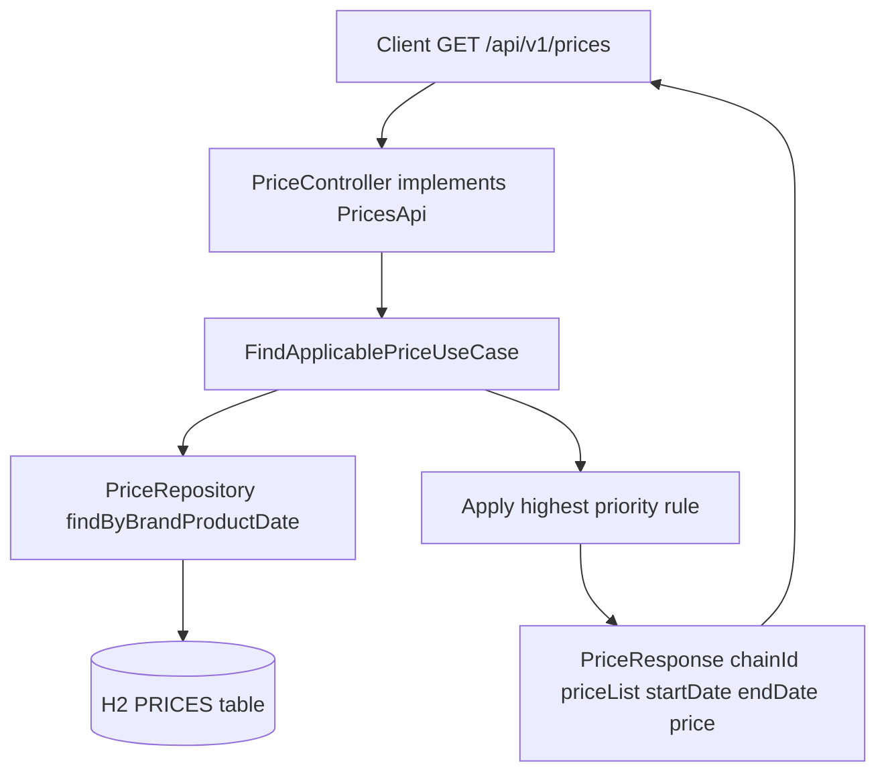
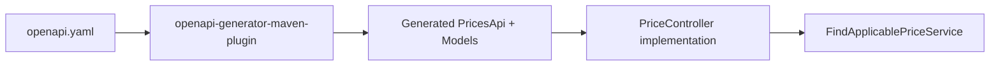

# Plan: Price Query API (API-First / OpenAPI)

## Context
The project already persists prices in an H2 `PRICES` table (via `PriceEntity`, `PriceRepository`, and `PriceDataLoader` loading `data/prices.json`). There is currently **no inbound REST API** for querying prices. The goal is to expose a price-query endpoint following **API-first** methodology and **OpenAPI 3 best practices**, using `openapi-generator-maven-plugin` to generate the server contract (interfaces + DTOs) from a single `openapi.yaml` source of truth, then implementing the generated interfaces with the existing hexagonal/DDD structure.

## Business Rule (Inditex-style price selection)
Given `applicationDate`, `productId`, `chainId` (mapped to `brandId`):
1. Find all `PRICES` rows where `product_id = ?`, `brand_id = ?`, and `applicationDate` is between `start_date` and `end_date`.
2. If multiple rows match, return the one with the **highest `priority`** (higher number wins).
3. If none match, return `404 Not Found`.

## OpenAPI Contract (`src/main/resources/openapi/price-api.yaml`)
- `openapi: 3.1.0`, `info` with title/version/description, `servers` with `/` base.
- `GET /api/v1/prices` operation:
  - Query params (all required):
    - `applicationDate` (string, date-time, RFC3339)
    - `productId` (integer, int64)
    - `chainId` (integer, int64) — public name for `brandId`
  - Responses:
    - `200` -> `PriceResponse`: `productId` (int64), `chainId` (int64), `priceList` (int64, "tarifa a aplicar"), `startDate` (date-time, "fecha de aplicacion inicio"), `endDate` (date-time, "fecha de aplicacion fin"), `price` (number/BigDecimal, "precio final a aplicar"), `currency` (string).
    - `400` -> `ErrorResponse` (validation: missing/invalid params).
    - `404` -> `ErrorResponse` (no applicable price).
    - `500` -> `ErrorResponse`.
- Reusable components: `PriceResponse`, `ErrorResponse` schemas; `Problem` style error with `code`, `message`.
- Generator config: `spring-server` (or `spring`), `interfaceOnly=true`, `useSpringBoot3=true`, model/API package under `com.bcnc.ecomerce.catalog.adapter.in.rest.api` and `...api.model`.

## Implementation Steps (todo list)
1. Add `openapi-generator-maven-plugin` to `pom.xml` bound to `generate-sources`, pointing at `src/main/resources/openapi/price-api.yaml`, generating Spring interfaces + models into `target/generated-sources`.
2. Create `src/main/resources/openapi/price-api.yaml` with the contract above (best practices: operationIds, examples, required params, typed errors).
3. Add a query method to `PriceRepository` (or a custom finder) to select candidate prices by `brandId`, `productId`, and date range.
4. Create domain/application layer: `FindApplicablePriceUseCase` (port-in) + `FindApplicablePriceService` applying the priority rule; map `chainId` -> `brandId`.
5. Create a persistence mapper `PricePersistenceMapper` (`PriceEntity` <-> domain `Price`).
6. Implement the generated API interface in `PriceController` (adapter/in/rest), delegating to the use case; translate `404`/validation to proper HTTP statuses; map domain `Price` -> generated `PriceResponse` (with `chainId` from `brandId`).
7. Add a global exception handler (`@RestControllerAdvice`) for `400`/`404`/`500` returning `ErrorResponse`.
8. Build & verify: `./mvnw generate-sources` then `./mvnw spring-boot:run`; hit the endpoint with the 4 known test dates from `prices.json` and confirm correct `priceList`/`price` per priority rule.
9. Add contract/integration tests (MockMvc or `@SpringBootTest`) covering the 5 classic scenarios (the 4 dates + a no-match 404).

## Architecture / Layering (consistent with existing code)
- `domain/model/Price.java` — already exists; reuse as the domain representation.
- `adapter/out/persistence/entity/PriceEntity.java` — already exists.
- `adapter/out/persistence/repository/PriceRepository.java` — add finder.
- `application/port/in/FindApplicablePriceUseCase.java` — new.
- `application/service/FindApplicablePriceService.java` — new.
- `adapter/in/rest/PriceController.java` — implements generated `PricesApi` interface.
- Generated: `adapter/in/rest/api/PricesApi.java`, `adapter/in/rest/api/model/PriceResponse.java`, `ErrorResponse.java`.

## Mermaid: Request Flow

## Mermaid: Build / API-First Flow

